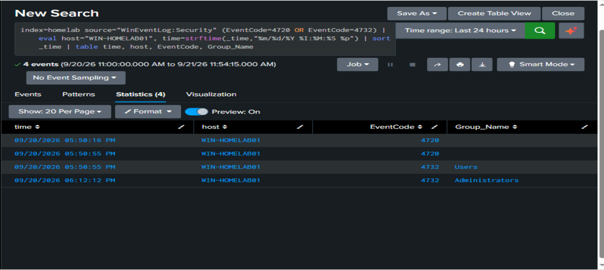
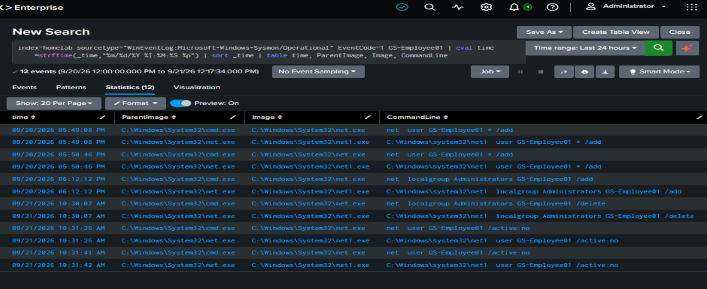
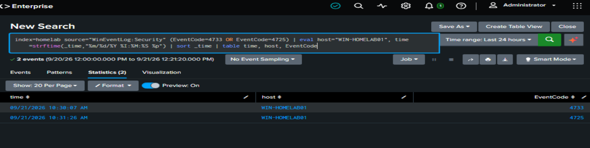
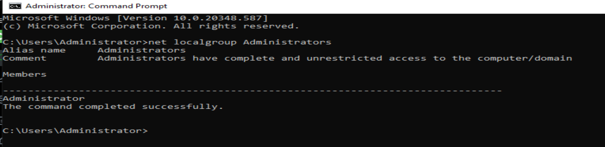

# Investigation 02 — Local Account Created and Added to Administrators

Status: complete. Controlled, authorized lab exercise on a VM I own; hostname fictionalized. Educational lab simulation, not production or professional experience.

## 1. Scenario
A test account (`GS-Employee01`) was created and then added to the local Administrators group on the lab Splunk server (`WIN-HOMELAB01`). The analyst then investigated the resulting telemetry as if it were an unexplained alert.

## 2. Objective
Practice detecting and investigating privilege escalation through local account manipulation: baseline -> event -> search -> triage -> 5Ws -> response -> documentation.

## 3. Environment
Windows Server 2022 VM (VMware Workstation), Splunk Enterprise 10.4.2 on the same VM, Windows Security and Sysmon Operational events indexed to `index=homelab`.

## 4. Baseline (before the event)
Source: GS Baseline 01 (current telemetry window only, not a historical baseline). Local accounts were built-ins only; `Administrator` was the only member of local Administrators; zero 4720, 4732 and 4738 events; no network (type 3) or remote desktop (type 10) logons.

## 5. Trigger
Local console session as `Administrator` in Command Prompt: an account was created (first attempt failed the password policy, second succeeded), then the account was added to Administrators at 6:12 PM.

## 6. Detection and evidence
- Security: user account created (4720) x2 [one failed attempt, one success], user account deleted (4726) x1 [rollback of the failed attempt], account enabled (4722), password reset attempt (4724), account changed (4738).
- Security: member added to a security-enabled local group (4732) x2: group `Users` at 5:50 PM (routine, automatic on account creation) and group `Administrators` at 6:12 PM (the deviation).
- Sysmon process creation: `net1 localgroup Administrators GS-Employee01 /add`, parent `net.exe`, whose parent was `cmd.exe`.
- The account-creation command used `*` so the password never appeared in the command line.

## 7. Triage
Deviation from baseline: new account holding admin rights, created and elevated about 22 minutes apart, with no change ticket. Verdict: suspicious until verified. A single event (for example 4672 or a bare 4732) is not proof; the group name and sequence matter.

## 8. 5Ws + How
- WHO: account `Administrator`.
- WHAT: `GS-Employee01` added to the local Administrators group.
- WHEN: 6:12 PM on 2026-09-20 (Pacific), about 22 minutes after account creation at 5:50 PM.
- WHERE: host `WIN-HOMELAB01` (lab Splunk server), local console session.
- HOW: `cmd.exe` -> `net.exe` -> `net1.exe` with `localgroup Administrators GS-Employee01 /add`.
- WHY: not determinable from logs. In this lab it was an authorized test; in production it would require confirming with the account owner or a change record.

## 9. MITRE ATT&CK
T1136.001 Create Account: Local Account; T1098 Account Manipulation.

## 10. Severity / risk
Lab exercise. In production: medium to high until authorization is confirmed, because an unapproved admin account gives persistent privileged access.

## 11. Response
Evidence preserved (events remain in Splunk; searches recorded). Then: account removed from Administrators (net localgroup ... /delete) and account disabled (/active:no). Verification: `net localgroup Administrators` shows only `Administrator` (matches baseline). Splunk confirmed member removed from local group (4733) at 10:30 AM and user account disabled (4725) at 10:31 AM on 2026-09-21, matching the commands run. Not done: account deletion, escalation to an owner.

## 12. Lessons learned
- Counting an event is not enough: which group and what sequence matter.
- A failed attempt still leaves telemetry (create then delete).
- Two 4732 events had different meanings (Users vs Administrators).
- Read-only `net user` commands look similar to modifying ones; filter on `/add`.
- Keep passwords out of command lines (`*` prompts instead).
- Limitation: baseline covers a short telemetry window; earlier Splunk history is unavailable and unexplained.

## 13. Correlation search (detection idea)
Flags an account that was created and then added to Administrators shortly after (default 60 minutes; adjust). Uses Security events: 4720 (account created) and 4732 (added to local group, filtered to Administrators). Group_Name is an auto-extracted field; Account_Name holds two values per event, so verify which value is the target account before relying on it.

`index=homelab source="WinEventLog:Security" (EventCode=4720 OR (EventCode=4732 Group_Name="Administrators")) | eval host="WIN-HOMELAB01" | sort _time | table _time, host, EventCode, Account_Name, Group_Name`

Read the result as a sequence: a 4720 followed by a 4732 for Administrators within the window = escalate for review. This search was not converted into a saved alert; tuning and false-positive testing are future work.

## 14. Interview explanation (short)
"In my home lab I baselined account and logon activity first, then created a local test account and added it to Administrators. In Splunk I saw the account creation, a failed first attempt, and two group additions: Users, which is routine, and Administrators, which was the deviation. Sysmon showed the command chain cmd.exe to net.exe to net1.exe. I mapped it to T1136.001 and T1098, contained it by removing the account from Administrators and disabling it, and confirmed both actions in Splunk as events 4733 and 4725. It was a controlled lab exercise, not production experience."

## 15. Evidence
**1. Account created and added to groups** (4720 x2; 4732 for Users at 5:50 PM and Administrators at 6:12 PM)

**2. Process chain in Sysmon** (`net user /add`, `net localgroup Administrators /add`, then the response commands; cmd.exe -> net.exe -> net1.exe)

**3. Response confirmed in Security events** (4733 member removed at 10:30 AM, 4725 account disabled at 10:31 AM)

**4. Group back to baseline** (`net localgroup Administrators` shows only Administrator)

Note: each command appears twice in Sysmon because `net.exe` launches `net1.exe`; this is normal process behavior, not duplicate ingestion.
